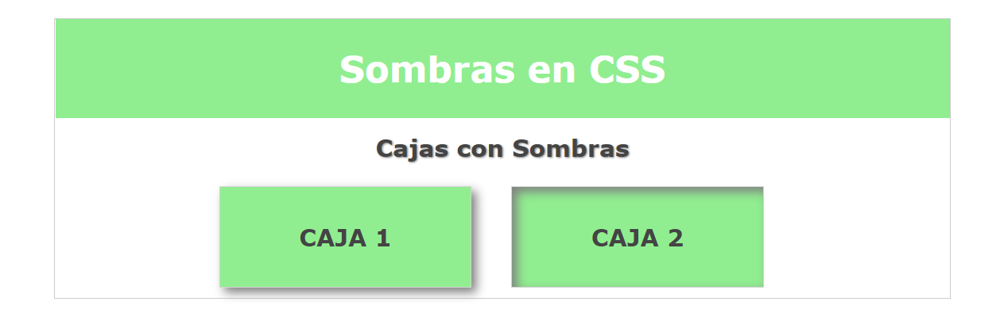
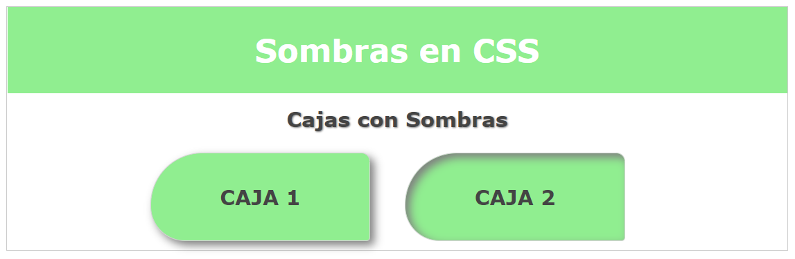

# Sombras
## Sombras en textos
```CSS
#content > h1 {
    ...
    /* SOMBRAS A TEXTOS */
    /* text-shadow: en-x en-y difuminado color */
    text-shadow: 1px 1px 2px gray;
}
```
## Sombras en cajas
```CSS
#content .caja {
    ...
    /* SOMBRAS EN CAJAS */
    /* box-shadow: en-x en-y difuminado color */
    box-shadow: 5px 5px 10px grey;
}
```
## Sombra interior en cajas
con inset
```CSS
.sombra-interior {
    /* SOMBRA INTERIOR EN CAJAS */
    box-shadow: 5px 5px 10px grey inset !important;
}
```
## Bordes redondeados
```CSS
#content .caja {
    ...
    /* BORDES REDONDEADOS */
    border-radius: 30px;
    /* border-radius: supizq supder infder infizq */
    border-radius: 60px 10px 4px 40px;
    /* un circulo */
    border-radius: 100%;
}
```
### Sombras en cajas y textos



### Bordes redondos


Move along.