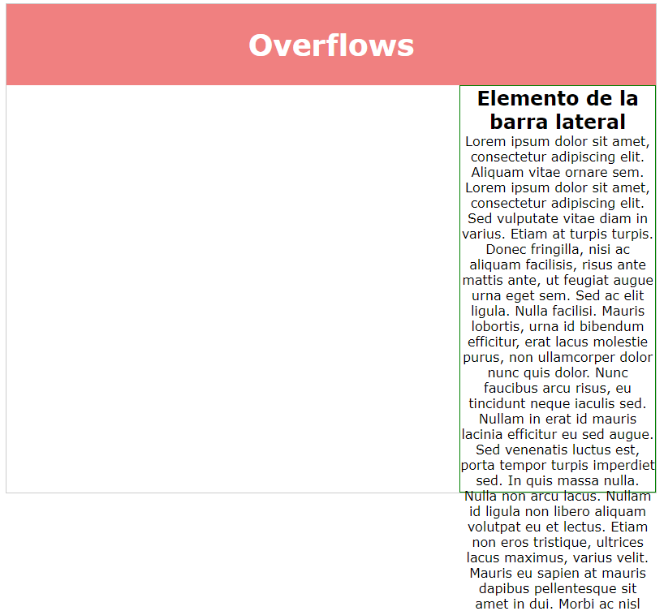
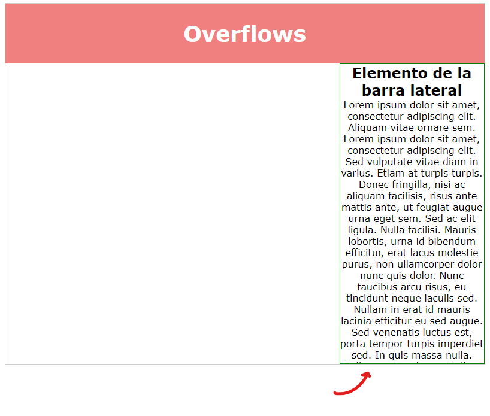
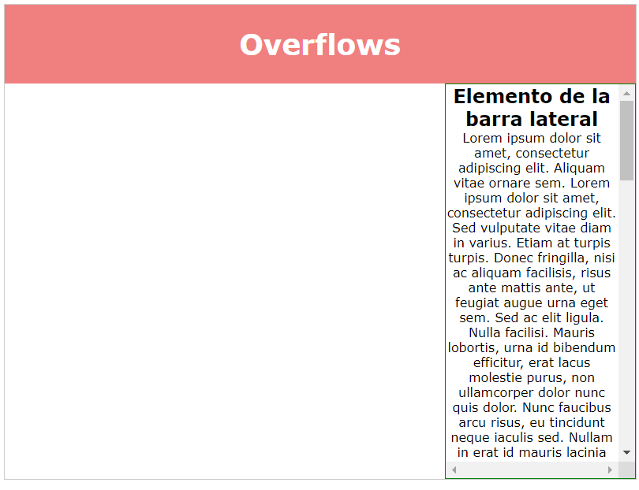
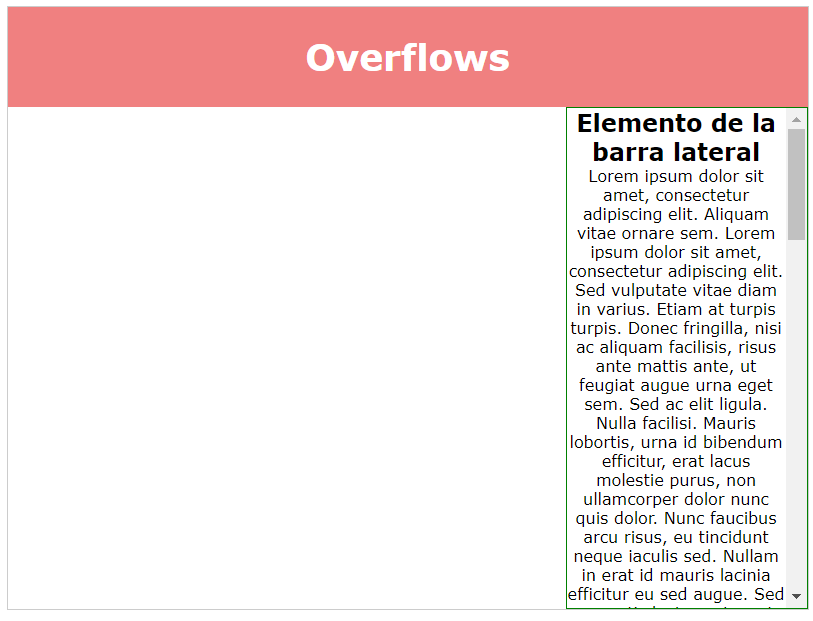

# Overflow

Es una propiedad que nos va a permitir controlar lo que se sale de una caja, y lo que se queda adentro. 

imaginate que tengo una caja de un tamaño limitado

```css
max-height: 650px;
```
y todo su contenido se sale fuera:


<!--  -->

hay una propiedad que se llama overflow, y tengo varias opciones:

```css
overflow: hidden;
```
Todo lo que se salga fuera de la caja va a desaparecer, no se queda visible.

<!--  -->

___

```css
overflow: visible;
```
Que es el por defecto, y el que podemos ver en la primera imagen.

___


```css
overflow: scroll;
```
Se crea una barra de desplazamiento, para que pueda ver ese contenido.

<!--  -->

___

A muchos no les gusta la barra horizontal del scroll 
```css
overflow-y: scroll;
```
me pondrá scroll solamente en el eje vertical.


<!--  -->
