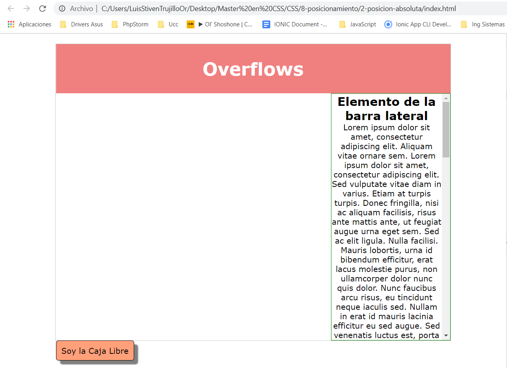
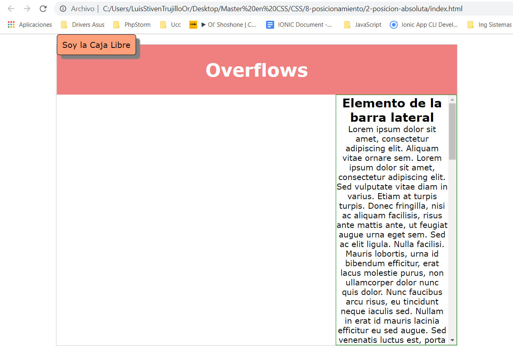
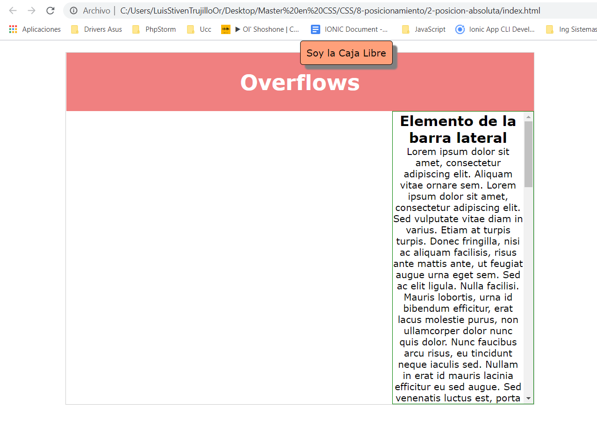
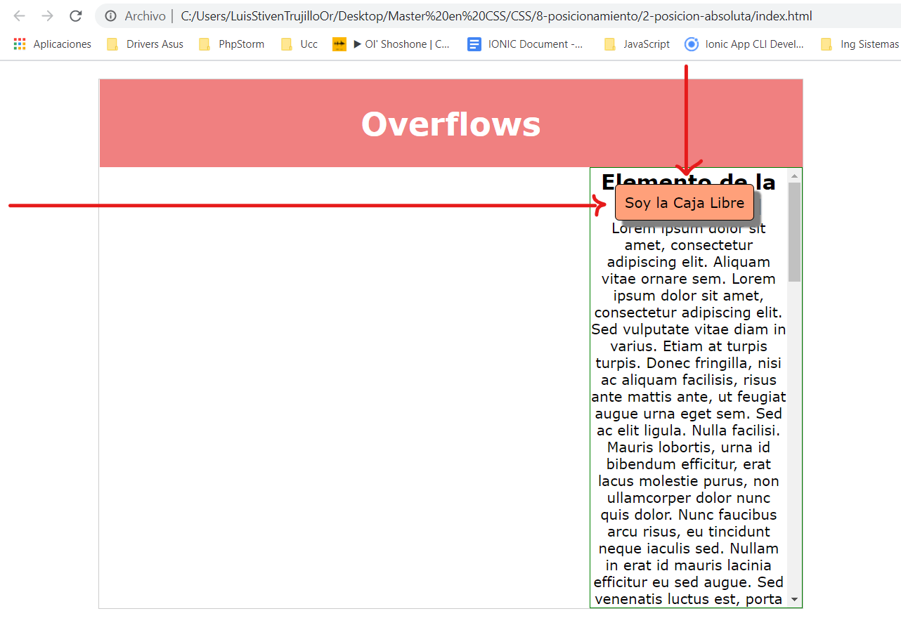
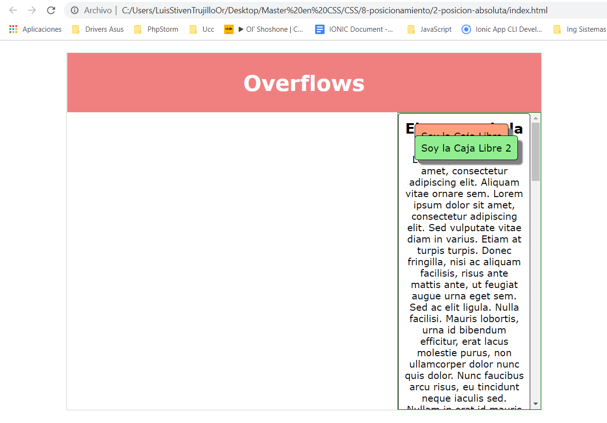
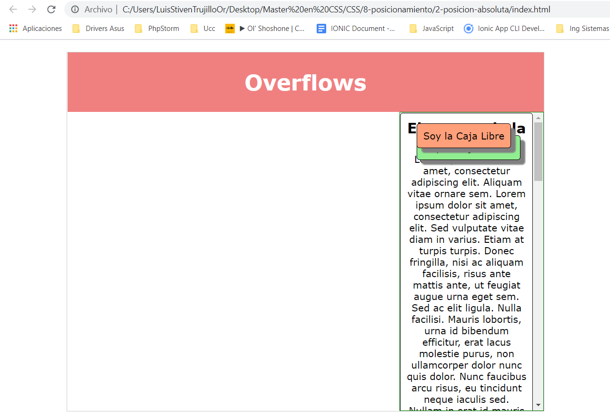

# Posición Absoluta
Con la propiedad position asignamos el tipo de posicionamiento.

```CSS
selector {
    position: relative;
}
```

la posición relativa es la por defecto
___

```CSS
selector {
    position: absolute;
}
```

vemos que todo cambia, ya no hace caso a los floats, ya no hace caso a nada.

en un principio se va a quedar donde estaba.


pero si yo utilizo la propiedad top
```CSS
selector {
    position: absolute;
    top: 0px;
}
```
Lo que hará es ponerse en el pixel cero desde arriba de su contenedor, saltandose cualquier elemento que hubiera, poniendose por encima de lo que haga falta:


por ejemplo si yo le pongo left:
```CSS
selector {
    position: absolute;
    top: 0px;
    left: 50%;
}
```
se pondrá en el 50 porciento a la izquierda, en otras palabras, va a mover esa caja un 50% desde la izquierda:

> Note que no lo centró, pero su posición si comenzó desde el centro

Puedo ponerla libremente donde yo quiera:
```CSS
selector {
    position: absolute;
    top: 140px;
    left: 700px;
}
```


¿Cómo puedo controlar yo que caja está encima de la otra?
## Z-index
```CSS
selector {
    position: absolute;
    top: 140px;
    left: 700px;

    background-color: lightsalmon;
}

selector2 {
    position: absolute;
    top: 160px;
    left: 700px;

    background-color: lightgreen;
}
```


Si utilizamos la propiedad z-index definiremos que caja esta encima de la otra (la de mayor número estára encima):
```CSS
selector {
    position: absolute;
    top: 140px;
    left: 700px;

    z-index: 2;

    background-color: lightsalmon;
}

selector2 {
    position: absolute;
    top: 160px;
    left: 700px;

    z-index: 1;

    background-color: lightgreen;
}
```


