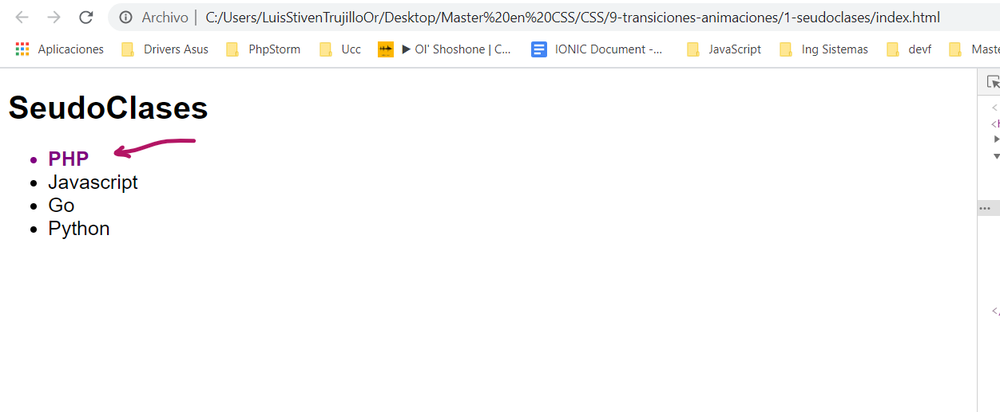
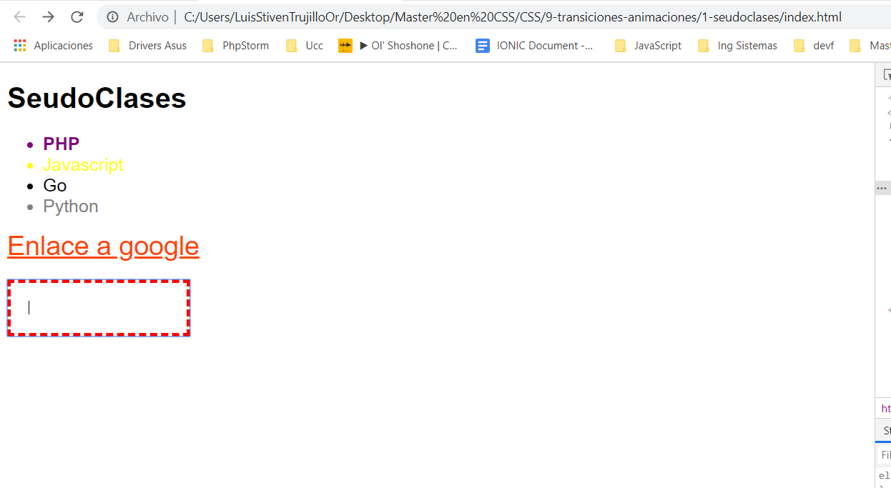

# Pseudoclases

Una seudoclase es un selector.

: algo.

Ejemplo:
```CSS
ul li:first-child {
    color: purple;
    font-weight: bold;
}
```


___
Existen psudoclases solo para enlaces:

Ejemplo:
```CSS
/* PSEUDOCLASES A ENLACES */
#mi-enlace {
    font-size: 30px;
    color: lightsalmon; 
}

/* cuando no he visitado ese enlace */
#mi-enlace:link {
    color: red;
}

/* cuando he visitado ese enlace */
#mi-enlace:visited {
    color: orangered;
}
```
___
Existen Pseudoclases para cualquier elemento

Por ejemplo:

```CSS
/* PSEUDOCLASES PARA TODOS LOS ELEMENTOS */
/* cuando yo pase por encima el raton */
#mi-enlace:hover {
    color: blue;
}

/* al momento de estar pulsando */
#mi-enlace:active {
    color: green;
    font-family: Impact, Haettenschweiler, 'Arial Narrow Bold', sans-serif;
}

input[type="text"] {
    display: block;
    margin-top: 20px;
    padding: 20px;
}

/* cuando este haciendo focus en el campo */
input[type="text"]:focus {
    border: 4px dashed red;
}
```
___
Finalmente:

